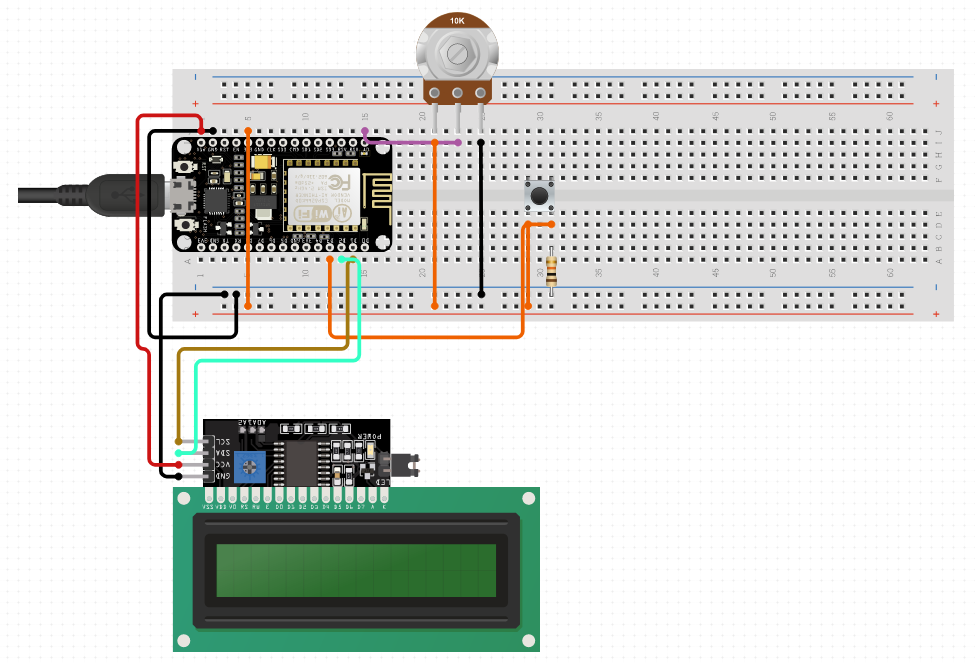

[Retour Accueil](../readme.md)

## Conception Electroniqe

Le code livré est configuré avec le pinage suivant :

__NB :__ Toute cette configuration peut être facilitée en utilisant un shield Groove. Il faudra cependant veiller à utiliser les Pins D1 et D2 pour la mise en place de la communication I2C avec l'écran LCD RGB.

Vous pouvez redéfinir les pins associés au potentiomètre et au bouton poussoir en modifiant les lignes de codes suivantes dans le fichier "user.h"

    #define Push  16
    #define Pot  0

En revanche, nous vous recommandons de ne pas vous référer au noms des PINS inscrits sur la board. Il faut en réalité se référer au numéro de GPIO sur la datasheet du NodeMCU.

